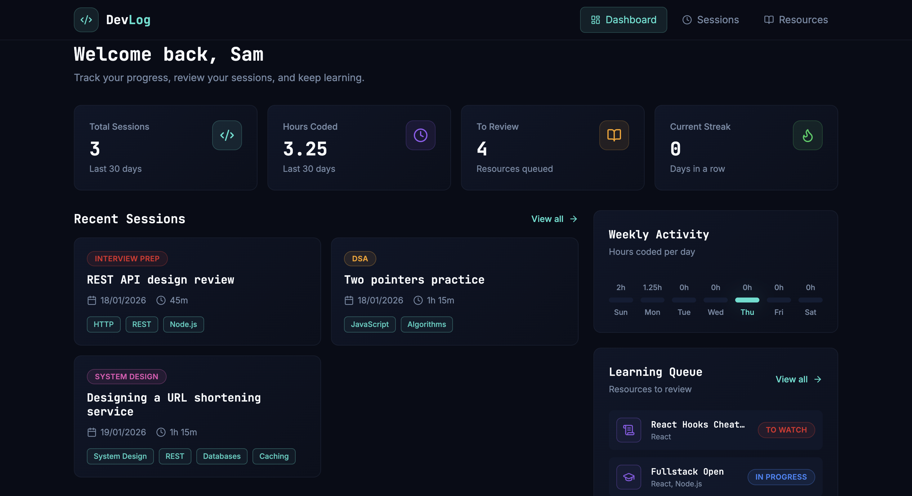

# DevLog

A full‑stack MERN productivity web application that helps developers log their coding sessions and manage learning resources in one place.

Live Demo: https://devlogapp.duckdns.org/

---

## Preview



---

## Features

### Coding Sessions 

Each coding session includes:

- Title 
- Date
- Duration (minutes)
- Type (Project, Tutorial, Interview Prep, DSA, etc.)
- Tech stack (tags like React, Node.js, MongoDB)
- Notes 

Supported actions:

- Create a session
- View all sessions
- Edit a session
- Delete a session

### Learning Resources

Each resource includes:

- Title
- Category (Video, Repo / Code Sample, Documentation)
- Topic (React, MongoDB, Algorithms, etc.)
- Status (To Watch, In Progress, Completed)
- URL
- Notes

Supported actions:

- Create a resource
- View all resources
- Edit a resource
- Delete a resource

### Dashboard overview

A high‑level overvie of 
- Total sessions logged and total time spent coding in the last 30 days
- Number of resources marked To Watch or In Progress
- A daily streak count for coding sessions
- Weekly activity chart displaying the number of hours spent coding everyday

### Searching, Filtering & Sorting

To improve usability: 

- Search bar for searching sessions (by title) and resources (by title and topics)
- Sessions can be filtered by session type and sorted by date (asc or desc)
- Resources can be filtered by resource status and category 

---

## Tech Stack

### Frontend
- React (Vite)
- Tailwind CSS

### Backend
- Node.js
- Express
- MongoDB (Mongoose)

### Infrastructure & DevOps

- AWS EC2 (Ubuntu)
- Nginx (reverse proxy)
- PM2 (process manager for Node)
- DuckDNS (custom domain)
- Certbot + Let’s Encrypt (HTTPS)
- GitHub Actions (auto deployment)
  
---

## Database Schema
```
Session {
_id: ObjectId,
title: String,
date: Date,
durationMinutes: Number,
type: String,
techStack: [String],
notes: String,
createdAt: Date,
updatedAt: Date
}
```

```
Resource {
_id: ObjectId,
title: String,
category: String,
topics: [String],
status: String,
url: String,
notes: String,
createdAt: Date,
updatedAt: Date
}
```
---
